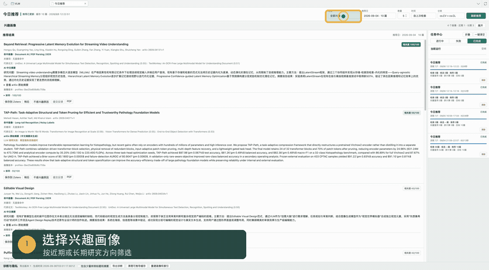

<div align="center">
  

# Zotero Paper Radar

**让 Zotero 主动发现下一篇值得读的论文。**

An explainable paper recommendation workspace for Zotero, with editable interest
profiles, AI summaries, and one-click imports.

[](https://github.com/kongyan66/zotero-paper-radar/releases)
[](https://www.zotero.org/)
[](https://github.com/kongyan66/zotero-paper-radar/actions/workflows/plugin-build.yml)
[](./LICENSE)

[下载插件](https://github.com/kongyan66/zotero-paper-radar/releases) ·
[安装说明](./zotero-plugin/docs/installation.md) ·
[问题反馈](https://github.com/kongyan66/zotero-paper-radar/issues)


</div>

## 为什么是 Paper Radar

Zotero Paper Radar 把论文发现流程直接放进 Zotero：从本地文献库提取近期与长期
兴趣，检索 arXiv 新论文，解释推荐依据，并让你决定保存、稍后阅读或提交反馈。
任务由用户手动启动，日常使用无需配置 GitHub Actions、Python 或邮箱。

## 核心能力

| 能力 | 说明 |
| --- | --- |
| 兴趣画像 | 从 Zotero 文献库构建近期与长期兴趣，支持编辑、锁定、停用、合并与拆分 |
| 可控检索 | 自由选择画像、推荐日、数量、时间范围和多个 arXiv 分类 |
| 可解释排序 | 展示匹配画像、关键词、代表论文、相关度及评分依据 |
| AI 中文摘要 | 可选 LLM 中文摘要；关闭或调用失败时保留 arXiv 原始摘要 |
| 保存与反馈 | 一键保存论文和 PDF，支持稍后处理及不感兴趣反馈 |
| 七天历史 | 按日期浏览最近七天的有效推荐，并避免窗口内重复推荐 |
| 任务诊断 | 查看执行时间、检索量、有效候选、推荐量和 Embedding 缓存复用情况 |

## 工作流程

```text
Zotero 文献库
      ↓
近期 / 长期兴趣画像
      ↓
arXiv 检索与 Embedding 排序
      ↓
推荐解释 + 可选中文摘要
      ↓
保存到 Zotero / 稍后 / 反馈
```

所有步骤都在“今日推荐”工作台内完成。右侧任务中心会同步显示执行阶段、耗时、
候选数量与缓存命中情况，便于判断检索是否真正找到新论文。

## 安装

当前版本支持 **Zotero 9.x**，项目处于 Beta 阶段。

1. 从 [Releases](https://github.com/kongyan66/zotero-paper-radar/releases)
   下载 `zotero-paper-radar.xpi`。
2. 打开 Zotero 的 `工具 > 插件`。
3. 点击右上角齿轮，选择“从文件安装插件”。
4. 选择下载的 XPI，并按提示重启 Zotero。

完整步骤与升级说明见[安装与首次运行](./zotero-plugin/docs/installation.md)。

## 模型配置

首次使用时，在 Zotero 设置中的 **Zotero Paper Radar** 页面完成配置：

1. 配置并测试 Embedding 服务。Embedding 是生成画像和推荐排序的必需项。
2. 按需开启 LLM 中文摘要。LLM 为可选项，不影响原始英文摘要展示。
3. 确认模型连接后创建兴趣画像，再打开“今日推荐”刷新结果。

插件预置 OpenAI-compatible、火山方舟与硅基流动配置，同时允许自由编辑服务地址
和模型 ID。模型费用、额度、地区可用性及响应速度由所选服务商决定。

## 数据与隐私

- 画像、推荐历史和 Embedding 缓存保存在本机。
- 只有模型处理所需的论文标题与摘要会发送到你配置的模型服务。
- API 密钥保存在本机 Zotero 偏好设置中。
- 默认诊断导出不包含 API 密钥和论文正文。
- 演示动图仅包含公开 arXiv 元数据，不包含模型设置或密钥。

## 升级兼容

本插件原展示名为 **Zotero arXiv Daily**。更名后继续保留原插件 ID、设置键和
数据库名称，新 XPI 会作为同一插件升级，并沿用既有配置、画像与推荐历史。

## 已知边界

- 当前论文来源仅为 arXiv，尚无后台自动定时任务。
- 检索无新候选时可能显示上一次有结果的推荐；推荐日列表不显示零结果批次。
- “相关度”是排序展示分数，不代表论文适合你的概率。
- arXiv 限流、网络异常或模型服务失败时，任务中心会显示错误并提供重试入口。

## 开发

需要 Node.js 20 或更高版本：

```bash
cd zotero-plugin
npm ci
npm run check
npm run build
```

构建产物位于 `zotero-plugin/.scaffold/build/zotero-paper-radar.xpi`。
Zotero 宿主测试使用独立配置目录：`npm run test:zotero`。
构建与发布工作流见 [plugin-build.yml](./.github/workflows/plugin-build.yml)。

## 项目来源与致谢

本仓库起源于
[TideDra/zotero-arxiv-daily](https://github.com/TideDra/zotero-arxiv-daily)，
感谢原作者关于“基于 Zotero 文献库发现新论文”的实现与贡献。Zotero Paper Radar
将这一路径扩展为 Zotero 内可操作、可解释的论文推荐工作台。

原邮件工作流及文档保留在[邮件版使用说明](./README.legacy.md)中。插件工程基础与
其他参考项目列于
[THIRD_PARTY_NOTICES.md](./zotero-plugin/THIRD_PARTY_NOTICES.md)。

本项目为独立社区项目，与 Zotero、arXiv 及模型供应商不存在官方隶属关系。
项目遵循 [AGPLv3 许可证](./LICENSE)，并保留原项目许可与署名信息。
